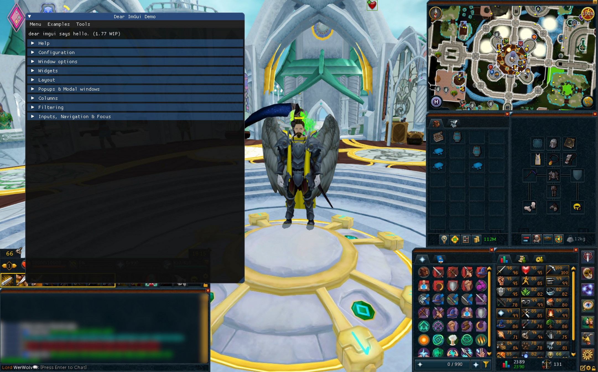
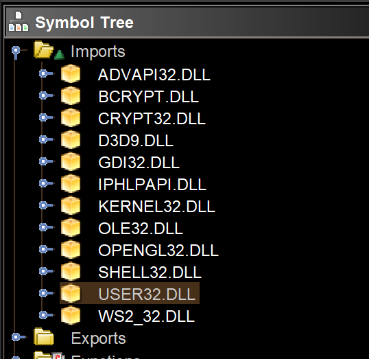
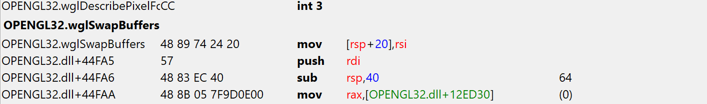
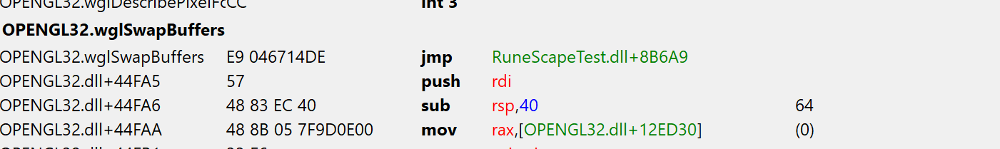

import NotePanel from '@/NotePanel'

## Introduction

I started this project mainly because I wanted a proper XP tracker I didn't have to pay extra for since the price felt really unjustifiable to me.

This page explains how I used Visual C++ to write a DLL injector toolfor [RuneScape's](http://runescape.com/)
NXT Client together with a DLL that hooks into RuneScape's OpenGL draw calls to render a [dear ImGui](https://github.com/ocornut/imgui) overlay on top of it.



## DLL Injecting

For the DLL Injector, I used a basic C++ `Console App` from Visual Studio. We don't need anything fancy for this PoC.

The principle of DLL injection is the following:

    1. Find the PID of the process the DLL should be injected to.
    2. Use the Windows API to get a Handle for that Process.
    3. Allocate some memory in the target process and copy the DLL's path into it.
    4. Start a new Thread in the target process with `LoadLibraryA` as the start routine.

In code, this looks like follows:

### Finding the PID

```cpp
std::uint32_t pid = 0;

// Loop infinitely till RuneScape is launched
while (pid == 0) {
    pid = getPID(L"rs2client.exe");
    Sleep(1000);
}
```

```cpp
#include <Windows.h>
#include <TlHelp32.h>
#include <cstdint>
#include <string>

std::uint32_t getPID(const std::wstring &processName) {
    std:uint32_t pid = 0;

    // Create snapshot
    HANDLE hSnap = CreateToolhelp32Snapshot(TH32CS_SNAPPROCESS, 0);

    // Check if the snapshot is valid, otherwise bail out
    if (hSnap == INVALID_HANDLE_VALUE)
        return 0;

    PROCESSENTRY32 procEntry{};
    procEntry.dwSize = sizeof(PROCESSENTRY32);

    // Iterate over all processes in the snapshot
    if (Process32First(hSnap, &procEntry)) {
        do {
            // Check if current process name is the same
            // as the passed in process name
            if (_wcsicmp(procEntry.szExeFile, processName.c_str()) == 0) {
                pid = procEntry.th32ProcessID;
                break;
            }
        } while (Process32Next(hSnap, &procEntry));
    }

    // Cleanup
    CloseHandle(hSnap);

    return pid;
}
```

This code uses the Windows API found in the `Windows.h` header to first create a snapshot of all running processes
using `CreateToolhelp32Snapshot(TH32CS_SNAPPROCESS, 0)` and then iterating over it continuously calling `Process32Next(hSnap, &procEntry)`
to get the next entry in the list. This is done until the process name of the current process matches the passed in name,
in our case `rs2client.exe`.

### Getting a Process Handle

This is super simple and straight-forward. We can just use the Windows API again.

```cpp
HANDLE hProc = OpenProcess(PROCESS_ALL_ACCESS, FALSE, pid);
```

This will give us a handle based on the PID with full access to that process. It's how we interact with the RuneScape client.

### Allocate memory in the target process

This part is done in preparation for the next step. It's allocting memory in the remote process and places the DLL string inside of it.
This is needed since we need to call the LoadLibrary function there which takes in the path to the DLL to load.

```cpp
// Allocate memory in the remote process
void *injectDllPathRemote = VirtualAllocEx(hProc, 0x00,
    MAX_PATH, MEM_COMMIT | MEM_RESERVE, PAGE_READWRITE);

// If allocation failed, bail out
if (injectDllPathRemote == nullptr)
    return 1;

// Write DLL path to the memory we just allocated
constexpr const char *DllPath = "C:\\path\\to\\inject.dll";
WriteProcessMemory(hProc, injectDllPathRemote, DllPath, strlen(dllPath) + 1, 0);
```

### Starting the thread

Now we're putting everything together. Starting a thread in the RuneScape process using `CreateRemoteThread(...)` with LoadLibraryA as the
thread routine. This actually only works because of the nice coincidence that the signature of a `LPTHREAD_START_ROUTINE` is very similar to
the one of `LoadLibraryA`. Both functions have a pointer as argument and a integer as return value. If there were more parameters to this function, it would get a lot more difficult to do DLL injection.

```cpp
// Create a thread in the RuneScape process which
// runs LoadLibraryA("C:\\path\\to\\inject.dll")
HANDLE hRemoteThread = CreateRemoteThread(hProc, nullptr, 0,
    (LPTHREAD_START_ROUTINE)LoadLibraryA, injectDllPathRemote, 0, nullptr);

// Check if we succeeded
if (hRemoteThread != nullptr && hRemoteThread != INVALID_HANDLE_VALUE)
    CloseHandle(hRemoteThread);
else
    printf("[*] Error starting thread! Error Code: %x\n", GetLastError());
```

If `CreateRemoteThread`, we can now execute our code in the context of the target process allowing us to read it's memory directly, patch code and insert hooks. Now we have to make a DLL that handles the hooking.

## Building the DLL

A DLL can be made by creating a `Dynamic-Link Library (DLL)` project in Visual Studio which sets up all the build configuration correctly and
includes a basic template containing the DLL's `DllMain(...)` entry-point function.

### Running code

To actually run our code in the Game, we need to start yet another thread. This is generally a bad idea
since during `DllMain` runs, Windows' loader lock is held. This means many Windows calls that use the loader will cause the application to dead-lock. We don't use any of these functions here though so we're safe for the most part. In our case, a thread is definitely needed since `DllMain` blocks both our injector and API calls elsewhere in the target application. Therefor it has to run and finish quickly without blocking us.

Our DLL simply creates a new thread that runs our code when being loaded.

```cpp
BOOL APIENTRY DllMain(HMODULE hModule, DWORD ul_reason_for_call, LPVOID lpReserved) {
    switch (ul_reason_for_call) {
    case DLL_PROCESS_ATTACH: {
        HANDLE hThread = CreateThread(nullptr, 0,
            (LPTHREAD_START_ROUTINE)patcherThread, hModule, 0, 0);
        if (hThread != nullptr)
            CloseHandle(hThread);
        break;
    }
    case DLL_THREAD_ATTACH:
    case DLL_THREAD_DETACH:
    case DLL_PROCESS_DETACH:
        break;
    }

    return TRUE;
}
```

### Getting console output from the DLL

For debug purposes it's usually useful to have some sort of logging in our application. Luckily, the Windows API once again got us covered. Using the `AllocConsole` function allows us to create a new console window in the current program. Make sure to not close this window though as closing it will act as a `SIGINT` exception, potentially crashing the game if exceptions don't get handled properly.

```cpp
AllocConsole();                             // Open a new console window
FILE *f = new FILE();
freopen_s(&f, "CONOUT$", "w", stdout);      // Redirect stdout to CONOUT$, the
                                            // current console window.

printf("[*] Running under RuneScape!\n");   // Console works!
```

### Hooking OpenGL

The secret of drawing an overlay in any process is hooking the graphic library's "Frame End" function.
In case of OpenGL this function is called `wglSwapBuffers`, in case of DirectX it's `d3dEndScene`.
We simply let the Game draw all it's content and when it calls the function to end the current frame, we draw our overlay on top before calling the actual end frame function.

<NotePanel type="info">
  An easy way to find out what the Game you want to hook uses, is to load the Game executable into Ghidra and checking it's imports in the
  Symbol Tree.
</NotePanel>


(RuneScape imports both opengl32.dll AND d3d9.dll here but according to the wiki, it only uses Direct3D if OpenGL is not working)

But how does hooking even work?

A hook works by overwriting some instruction(s) in a functions code with a `jmp` instruction.

##### Before patching



##### After patching



This instruction will redirect execution flow to trampoline routine which first executes the instruction(s) we overwrote with the jump. Then we have to safe the current context. We don't know how our code modifies the registers but what we know is that after our code ran and execution gets back to the hooked function, they need to be in the same state as before our hook ran. Otherwise the original function might end up doing unpredictable things or just straight out crashes. This is usually done by pushing all registers onto the stack, executing the hook, poping all registers back into the right registers and then jumping back right after the injected `jmp` instruction in the original function.

```asm
PUBLIC wglSwapBuffersTrampoline

wglSwapBuffersTrampoline PROC
	mov [rsp + 20], rsi         ; Execute the instruction that
                                ; was overwritten by our hook patch.

	push rax                    ; Safe the current context.
	push rbx                    ; Pushing all the registers is probably
	push rcx                    ; overkill but better safe than sorry.
	push rdx
	push rsi
	push rdi
	push rbp
	push rsp
	push r8
	push r9
	push r10
	push r11
	push r12
	push r13
	push r14
	push r15

	call wglSwapBuffers_hook;    ; Call our hook

	pop r15                     ; Restore the context in reverse order
	pop r14                     ; as a Stack is a FILO buffer (First in last out)
	pop r13
	pop r12
	pop r11
	pop r10
	pop r9
	pop r8
	pop rsp
	pop rbp
	pop rdi
	pop rsi
	pop rdx
	pop rcx
	pop rbx
	pop rax

	jmp wglSwapBuffers_return    ; Jump back to the original function.
                                ; This is the address of where our jmp
                                ; instrction was inserted + 5, so immediately
                                ; after it.

wglSwapBuffersTrampoline ENDP
```

Now that we have a place for our hook to jump to, we need to insert it into the function we want to hook.
The following functions take care of removing code page write restrictions, inserting the hook and restoring the original restrictions again.

```cpp
namespace mem {

    template<typename T>
    T read(DWORD64 addr) {
        return *((T *)addr);
    }

    template<typename T>
    void write(DWORD64 addr, T value) {
        *((T *)addr) = value;
    }

    template<typename T>
    DWORD64 protect(DWORD64 addr, DWORD protection) {
        DWORD oldProtection;
        VirtualProtect((LPVOID)addr, sizeof(T), protection, &oldProtection);

        return oldProtection;
    }

    DWORD64 hookFunction(DWORD64 hookAt, DWORD64 newFunc, unsigned int size) {
        // -5 since the jump is relative to the next instruction
        DWORD64 newOffset = newFunc - hookAt - 5;

        auto oldProtection = mem::protect<DWORD[3]>(hookAt + 1, PAGE_EXECUTE_READWRITE);

        // Opcode of the jmp instruction
        mem::write<BYTE>(hookAt, 0xE9);
        mem::write<DWORD>(hookAt + 1, newOffset);

        // nop extra bytes to avoid corrupting the overwritten opcode
        for (unsigned int i = 5; i < size; i++)
            mem::write<BYTE>(hookAt + i, 0x90);

        mem::protect<DWORD[3]>(hookAt + 1, oldProtection);

        return hookAt + 5;
    }
}
```

Using this, a hook can be inserted as follows:

```cpp
using wglSwapBuffers_t = void(*)(_In_ HDC hDc);
extern "C" wglSwapBuffers_t wglSwapBuffers_return = nullptr;
extern "C" void wglSwapBuffersTrampoline();

// ...

// Get a handle to the opengl.dll
HMODULE hOpengl32 = GetModuleHandle(L"opengl32.dll");

if (hOpengl32 != nullptr) {
    // Get the address of wglSwapBuffers
    DWORD64 wglSwapBuffersHookAddr = (DWORD64)GetProcAddress(hOpengl32,
        "wglSwapBuffers");

    // Insert a hook to our trampolineat the start of wglSwapBuffers,
    // returns the address to return to
    wglSwapBuffers_return = (glSwapBuffers_t) mem::hookFunction(
        wglSwapBuffersHookAddr, (DWORD64)wglSwapBuffersTrampoline, 5
    );
}
```

### Drawing the overlay

Finally, after all this work we can start drawing the imgui overlay.
For this, we just download the imgui source code and compile it together with the rest of the DLL
code. Imgui also needs a opengl wrapper to compile, I used glew for this. For it to compile, both the opengl32.lib and glew32**s**.lib have to be linked into the DLL. opengl32.lib gets dynamically linked as it's already been loaded by RuneScape but glew **HAS** to be linked statically since we can't load another DLL within the injected DLL without risking a dead-lock.

Using the imgui impl files for win32 and opengl3 found in `examples` folder of it's repo, a simple overlay can be created. I used `imgui_impl_win32.h` and `imgui_impl_opengl3.h` for RuneScape but this depends heavily on what your game uses.

During initialization of our graphics stuff, we also hook the game's wndProc callback. It's use for us is to capture keyboard and mouse events and direct them to imgui. It also allows us to toggle the overlay though and taking away focus from the game when the overlay is present.

```cpp
HWND hGameWindow;
WNDPROC hGameWindowProc;
bool menuShown = true;

LRESULT CALLBACK windowProc_hook(HWND hWnd, UINT uMsg, WPARAM wParam, LPARAM lParam) {
    // Toggle the overlay using the delete key
    if (uMsg == WM_KEYDOWN && wParam == VK_DELETE) {
        menuShown = !menuShown;
        return false;
    }

    // If the overlay is shown, direct input to the overlay only
    if (menuShown) {
        CallWindowProc(ImGui_ImplWin32_WndProcHandler, hWnd, uMsg, wParam, lParam);
        return true;
    }

    // Otherwise call the game's wndProc function
    return CallWindowProc(hGameWindowProc, hWnd, uMsg, wParam, lParam);
}

void glSwapBuffers_hook(HDC hDc) {
    // Initialize glew and imgui but only once
    static bool imGuiInitialized = false;
    if (!imGuiInitialized) {
        imGuiInitialized = true;

        // Get the game's window from it's handle
        hGameWindow = WindowFromDC(hDc);

        // Overwrite the game's wndProc function
        hGameWindowProc = (WNDPROC)SetWindowLongPtr(hGameWindow,
            GWLP_WNDPROC, (LONG_PTR)windowProc_hook);

        // Init glew, create imgui context, init imgui
        glewInit();
        ImGui::CreateContext();
        ImGui_ImplWin32_Init(hGameWindow);
        ImGui_ImplOpenGL3_Init();
        ImGui::StyleColorsDark();
        ImGui::GetStyle().AntiAliasedFill = false;
        ImGui::GetStyle().AntiAliasedLines = false;
        ImGui::CaptureMouseFromApp();
        ImGui::GetStyle().WindowTitleAlign = ImVec2(0.5f, 0.5f);
    }

    // If the menu is shown, start a new frame and draw the demo window
    if (menuShown) {
        ImGui_ImplOpenGL3_NewFrame();
        ImGui_ImplWin32_NewFrame();
        ImGui::NewFrame();
        ImGui::ShowDemoWindow();
        ImGui::Render();

        // Draw the overlay
        ImGui_ImplOpenGL3_RenderDrawData(ImGui::GetDrawData());
    }
}
```

## Conclusion

While it's pretty simple to inject a DLL, there are a lot of things that can go wrong. Here are some of the issues I faced when writing this and how I got around them:

### LoadLibraryA fails with Access Denied

This happened after adding glew to the DLL. I tried to dynamically link to glew.dll by loading it in my own DLL. This does not work as my DLL now depended on glew already being loaded. I fixed it by simply linking glew statically.

### Calling any function in the hook causes a segfault

This was because I forgot to push/pop one register in the trampoline causing the context to be tainted
when returning back to the original function. I also originally didn't replicate the instruction I overwrote with the jump which caused the stack to corrupt when the hooked function tried to return

### Imgui doesn't receive any mouse input

StackOverflow suggested to use `SetWindowLong` to overwrite the wndProc function. This did not work and my hook was never called. Switching to `SetWindowLongPtr` instead fixed the issues.
