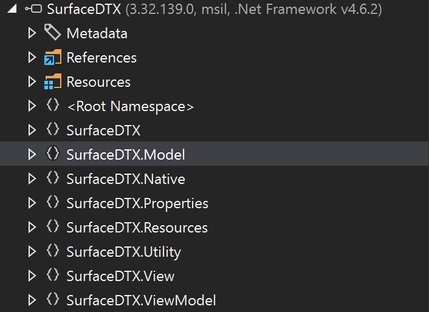
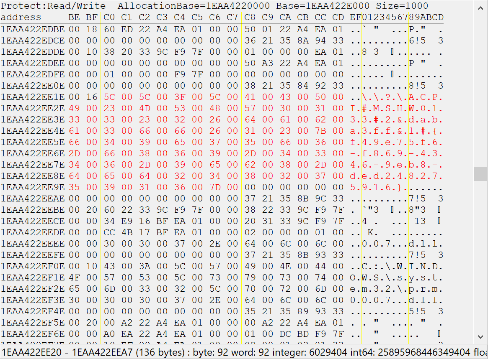

## Overview

The Surface Book 2 is one of Microsoft's self made notebooks. What makes it different from other laptops is it's deep integration of the drawing pen into Windows and the ability to detach the entire screen from it's base by pressing a button on the keyboard or using their pre-installed `SurfaceDTX` tool.

## Communication with hardware devices

Since Windows any many other operating systems run on a ton of different hardware, it's impossible to bundle support for every device directly into the Kernel, however userspace programs may still want to communicate with hardware installed in the computer. Instead of adding custom system calls for every device ever built, most OSes support loading of kernel extensions at runtime (kernel modules on Linux, device drivers on Windows) together with a unified way to communicate with these extensions, called `ioctl`.

The reason ioctl and device drivers are necessary in the first place is for security reasons. On startup all hardware devices found on- or connected to the computer's mainboard are mapped into the kernel's address space and have to be controled from there using extensions that live in the kernel's address space as well. The kernel's address space cannot be directly accessed by userspace applications so the kernel may allow access to certain devices through syscalls while denying access to others.

The greatness of `ioctl` comes from its simplicity. A single syscall is used on windows called `NtDeviceIoControlFile` with its wrapper function `DeviceIoControl`. It takes the following arguments:

- A `HANDLE` to the device, usually obtained by using the `NtCreateFile` syscall
- A control code describing the operation the device driver should execute. These codes consist of several fields:
  - Device type (cdrom, mouse, network, printer, etc.) values `0x8000` or greater are vendor specific devices (for example the latch mechanism on the Surface Book 2)
  - Function code describing the command the device driver should execute. These are arbitrary values defined in the individual drivers.
  - Transfer type specifying if the data gets buffered or not
  - Required access for operations, either read-only, write-only or read-write
- A pointer to a in-buffer sent to the device driver
- The size of the in-buffer
- A pointer to a out-buffer which will be filled with data returned from the driver
- The size of the out-buffer
- A pointer to a `uint32_t` where the received data size will be written to
- A optional pointer to a overlapped struct for async operations

When calling `DeviceIoControl` a syscall handler in the kernel gets called. That handler uses the passed device handler to find the right device driver to be called. The in-buffer then gets copied from user- into kernel space and the driver's `DEVICE_CONTROL` callback gets called containing the control code and pointers to the in- and out-buffers. The control code is used to figure out what operation should be executed, the in-buffer is used for parameters and the out-buffer for possible returned values.

## REing the Latch driver

To find out how the latch driver works, there are two possible approaches. Either we reverse engineer the device driver directly and analyze the `DEVICE_CONTROL` callback or we use the already implemented latch control tool Microsoft built to find the correct driver and control codes.

I decided to go for the latter since the tool was trivial to find (by simply looking at the task manager) and even better, it was written in C# containing full symbol information. To analyze the .NET application, I used `JetBrain dotPeek`. Simply looking through the different namespaces in dotPeek quickly made me discover a promising class called `DriverLatch.cs`.



Conveniently, at the very start of the file, the latch interface GUID and all the different control codes were specified.

```csharp
private static readonly Guid g_latchInterfaceId = new Guid("f49e75f6-f869-4346-9eb8-ded248275916");

private static readonly IOControlCode g_latchCommandIoctl = new IOControlCode((ushort) 32768, (ushort) 2065, (IOControlAccessMode) 2, (IOControlBufferingMethod) 0);
private static readonly IOControlCode g_latchChangedIoctl = new IOControlCode((ushort) 32768, (ushort) 2066, (IOControlAccessMode) 1, (IOControlBufferingMethod) 0);
private static readonly IOControlCode g_latchStatusIoctl = new IOControlCode((ushort) 32768, (ushort) 2064, (IOControlAccessMode) 1, (IOControlBufferingMethod) 0);
private static readonly IOControlCode g_detachChangedIoctl = new IOControlCode((ushort) 32768, (ushort) 2067, (IOControlAccessMode) 1, (IOControlBufferingMethod) 0);
private static readonly IOControlCode g_detachStateIoctl = new IOControlCode((ushort) 32768, (ushort) 2068, (IOControlAccessMode) 1, (IOControlBufferingMethod) 0);
```

The interesing one here is only `g_latchCommandIoctl` though since `*ChangedIoctl` control codes are callbacks and `*StateIoctl` control codes are there to query information about the current latch state.

Looking further through the class led to a method conveniently named `void OpenLatch(uint cancelAfterMs)`. It does exactly what the name implies, it sends a ioctl command through the .NET Windows API opening the latch. It does not return any values but it takes in a struct of data as input buffer:

```csharp
private enum LatchCommandType
{
    Invalid,
    Open,
    Close_DEPRECATED,
    ButtonPress,
    Cancel,
    MaximumValue,
}

[StructLayout(LayoutKind.Sequential, Pack = 1)]
private struct LatchCommandInArgs
{
    public DriverLatch.LatchCommandType LatchCommand;
    public uint TimeoutMs;
}
```

Again, very conveniently labeled :)

## Device Interface File

In order to send data to the driver, a handle is required which is returned by the `NtCreateFile` syscall. The issue is though, how to get the path of it? This, I couldn't figure out either at first. Consulting Microsoft's documentation didn't really help a lot either. The way I came up with is sadly not super great but it did the trick. The path always contains the GUID found previously in the source code. And for the .NET tool to communicate with the driver it needs to have the full path in memory somewhere. So why not use Cheat Engine's string search tool to search for the GUID string in memory and look around a bit to find the rest of the string. Important to note is, since this is a .NET application, all strings are stored in UTF-16. After some fiddling around, this is what turned up:



Or in plain text: `\\?\ACPI#MSHW0133#2&daba3ff&1#{f49e75f6-f869-4346-9eb8-ded248275916}`

## Putting it all together

To finish off, I wanted to write a program in C/C++ which simply unlocks the latch when executed. Having all the information required from the binary, this was rather trivial:

```cpp
#include <windows.h>
#include <cstdint>

enum class LatchCommandType : std::uint32_t {
    Invalid,
    Open,
    Close_DEPRECATED,
    ButtonPress,
    Cancel,
    MaximumValue
};

struct LatchCommandInArgs {
    LatchCommandType LatchCommand;
    std::uint32_t TimeoutMs;
} __attribute__((packed));

// Latch command ioctl control code
const DWORD latchCommandIoctl = CTL_CODE(0x8000, 2065, METHOD_BUFFERED, FILE_WRITE_ACCESS);

int main() {

    // Open a handle to the latch device driver
    HANDLE ioctlLatchFile = CreateFileW (
        L"\\\\?\\ACPI#MSHW0133#2&daba3ff&1#{f49e75f6-f869-4346-9eb8-ded248275916}",
        GENERIC_READ | GENERIC_WRITE,
        FILE_SHARE_READ | FILE_SHARE_WRITE,
        nullptr,
        OPEN_EXISTING,
        FILE_ATTRIBUTE_NORMAL,
        nullptr);

    // Specify the device driver arguments sent through the in-buffer
    LatchCommandInArgs args = { .LatchCommand = LatchCommandType::ButtonPress, .TimeoutMs = 5000 };
    DWORD readSize = 0;

    // Make the ioctl call, opening the latch
    DeviceIoControl(ioctlLatchFile, latchCommandIoctl, &args, sizeof(LatchCommandInArgs), nullptr, 0, &readSize, nullptr);

    return 0;

}
```

A open source implementation of SurfaceDTX written in C# can be found on my GitHub repository:

<p>
  <a href="https://github.com/WerWolv/SurfaceAlwaysDTX">
    
  </a>
</p>
